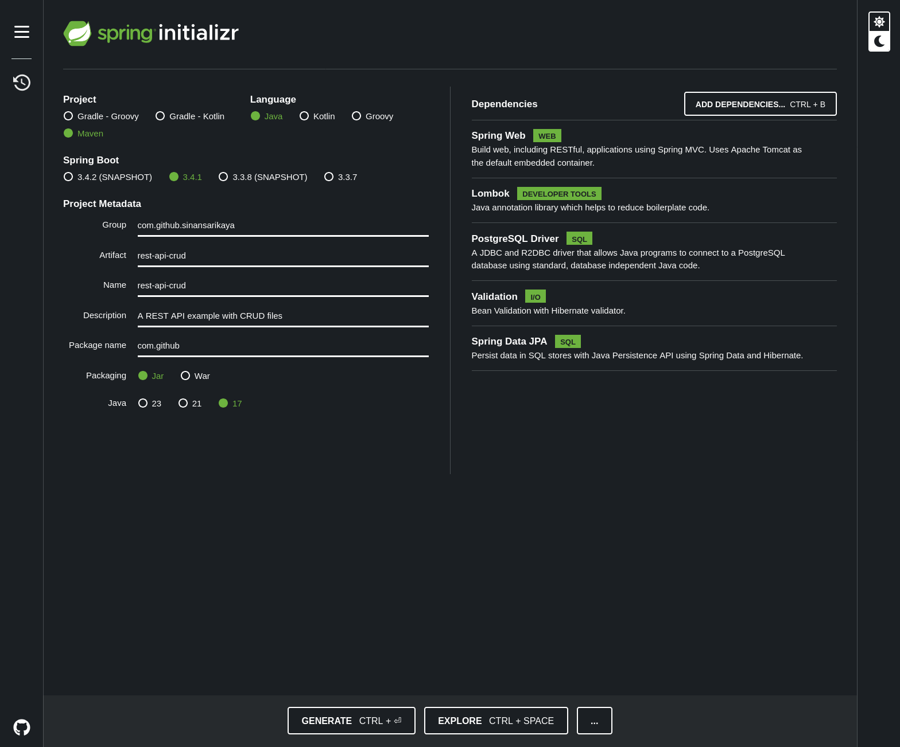

# REST API CRUD - Books Management



This project provides a **book management API**. The API includes basic CRUD (Create, Read, Update, Delete) operations for managing books, such as saving, updating, deleting, and listing books.

## Features

- **POST /books/save**: Save a book
- **GET /books/getById/{id}**: Get a book by its ID
- **GET /books/getAll**: List all books with pagination and sorting support
- **PUT /books/update/{id}**: Update an existing book
- **DELETE /books/delete/{id}**: Delete a book by its ID

## Requirements

- **Java 17** or higher
- **Spring Boot** 3.x
- **PostgreSQL** database
- **Maven** (or **Gradle**) build tool
- **IDE**: IntelliJ IDEA, Eclipse, or VSCode recommended

## Project Structure

- `com.github.controller`: API controllers
- `com.github.service`: Business logic and service layer
- `com.github.domain`: Domain models
- `com.github.dto`: Data Transfer Objects (DTOs)
- `com.github.mapper`: Entity-to-DTO conversion logic
- `com.github.repository`: Repository layer for database operations
- `com.github.exception`: Exception handling

## Cloning the Project to Your Computer

### 1. Clone the Project Using Git

Run the following command in your terminal or command prompt to clone the project to your computer:

```bash
git clone https://github.com/{your-github-username}/rest-api-crud.git
```

---

### 2. Open and Run the Project

Open the project in an IDE (IntelliJ IDEA, Eclipse, etc.) and follow the steps below.
### 3. application.properties Configuration

To ensure the application works correctly, you need to configure the PostgreSQL database settings in the application.properties file.

Open the src/main/resources/application.properties file and add the following lines:

# Application Name
spring.application.name=rest-api-crud

# PostgreSQL Database Connection Settings
spring.datasource.url=jdbc:postgresql://localhost:5432/crud  # Update this with your database URL
spring.datasource.username=username  # Your database username
spring.datasource.password=password  # Your database password

# JPA Settings
spring.jpa.hibernate.ddl-auto=update  # Automatically update the database schema
spring.jpa.properties.hibernate.dialect=org.hibernate.dialect.PostgreSQLDialect  # PostgreSQL Hibernate dialect
spring.jpa.properties.hibernate.format_sql=true
spring.jpa.show-sql=true  # Show SQL queries in logs

Note: Ensure that the PostgreSQL database is up and running, and that the crud database is created. Also, update the connection details in the file to match your setup.
### 4. Download Dependencies and Run the Application

You can start the application by running the following command in the terminal:

```bash
./mvnw spring-boot:run
```

If you're using Gradle, you can run:

```bash
./gradlew bootRun
```

Once the application starts successfully, you can access the API at:

```bash
http://localhost:8080
```
# API Usage

Below are the details for the API endpoints:
1. POST /books/save - Save a Book

You can save a new book by sending its information in JSON format.
Request Body:
```json
{
  "title": "Book Title",
  "author": "Author Name",
  "isbn": "1234567890",
  "description": "A brief description of the book",
  "price": 19.99
}
```

Response:

HTTP 200 OK and the newly created book information.

---

### 2. GET /books/getById/{id} - Get a Book by ID

You can retrieve a book by its ID using this endpoint.
Response:

The book details in JSON format.

---

### 3. GET /books/getAll - List All Books

This endpoint lists all the books with pagination and sorting support.
Request Parameters:

* page: Page number (Default: 0)
* size: Number of records per page (Default: 10)
* sort: Sorting field (Default: id)
* direction: Sorting direction (ASC or DESC)

Example:

```bash
GET /books/getAll?page=0&size=10&sort=title&direction=ASC
```
Response:

The list of books in JSON format.

---

### 4. PUT /books/update/{id} - Update a Book

You can update an existing book using this endpoint.
Request Body:

The updated book information.
Response:

HTTP 200 OK and the updated book details.

---

### 5. DELETE /books/delete/{id} - Delete a Book

This endpoint deletes a book by its ID.
Response:

HTTP 200 OK and a message confirming the book deletion.

# Best Practices

* DTO Usage: Using Data Transfer Objects (DTOs) for incoming and outgoing data reduces the dependency between the API and the domain layer.
* Validation: Use validation annotations like @Valid and @NotNull to ensure the integrity of the data received by the API.
* Error Handling: Implement custom error messages and exception handling mechanisms to provide a user-friendly API experience.
* Pagination and Sorting: Add pagination and sorting support to the API to improve performance with large datasets.

# Contributing

This project is open source and contributions are welcome. Please feel free to submit a pull request for any improvements or bug fixes.

```bash
You can now upload this **README.md** to your GitHub repository. It will help users understand how to get started with the project, use the API, and contribute to it.
```